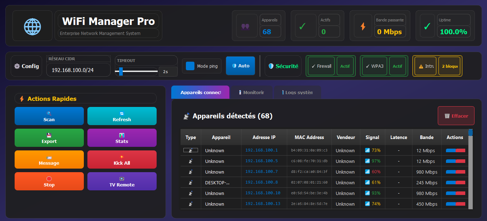

# WiFi Manager Pro 🌐

**Enterprise Network Management System** - A comprehensive Python desktop application for network scanning, monitoring, and device control.

[](https://www.python.org/)
[](https://pypi.org/project/PyQt5/)
[](LICENSE)
[](https://github.com/zahdineamine2003/Wifi-manager-ARP-)

---

## 📸 Dashboard Preview


*Professional network management interface with real-time monitoring, device control, and comprehensive security features*

---

## 🎥 Demo Video

### Device Kick Operation
Watch the complete demonstration of the device disconnection feature:

https://github.com/zahdineamine2003/Wifi-manager-ARP-/raw/main/demo/kick_operation_demo.mp4

*Full demonstration showing device selection, kick execution, and real-time monitoring*

---

## ✨ Key Features

### 🔍 Network Discovery
- **ARP Scanning**: Fast network-wide device discovery using Scapy
- **CIDR Configuration**: Flexible network range specification
- **Vendor Identification**: Automatic manufacturer lookup via IEEE OUI database (25,000+ entries)
- **Smart Detection**: Multi-criteria TV and mobile device recognition
- **Ping Integration**: Optional latency measurement for each device

### 📊 Real-Time Monitoring
- **Live Graphs**: Dual-axis charts tracking device counts and signal strength
- **Network Analytics**: Bandwidth aggregation and uptime calculation
- **5-Minute Window**: Rolling data display with 5-second updates
- **Color-Coded Metrics**: Intuitive visualization with professional dark theme

### 🎮 Device Management
- **Individual Kick**: Disconnect specific devices via ARP spoofing
- **Mass Kick**: Remove all devices except your own
- **Configurable Duration**: Set temporary or indefinite disconnection
- **Safety Features**: Automatic self-exclusion and gateway validation

### 📺 Smart TV Control
- **Auto-Detection**: Identifies TVs from 10+ brands (Samsung, LG, Sony, Philips, etc.)
- **Wake-on-LAN**: Power on TVs remotely
- **Complete Remote**: Volume, channels, navigation, and input control
- **App Launching**: Direct access to Netflix, YouTube, and more

### 📨 Multi-Protocol Messaging
- **Web Hijacking**: Display messages in target's browser automatically
- **UDP/TCP/Broadcast**: Multiple delivery methods for maximum compatibility
- **Windows Notifications**: System-level popups (when configured)
- **HTTP Integration**: Webhook and REST API support

### 💾 Data Export & Logging
- **CSV Export**: Timestamped reports with complete device information
- **Real-Time Logs**: Live event tracking in dedicated panel
- **UTF-8 Support**: International character compatibility

---

## 🚀 Quick Start

### Prerequisites
- **Python 3.7+** installed
- **Administrator/Root privileges** (required for network access)
- **Windows/Linux/macOS** compatible

### Installation (Automated)

#### Windows
```batch
# Run the automated installer
install_and_run.bat
```

#### Linux/macOS
```bash
# Make the script executable and run
chmod +x install_and_run.sh
./install_and_run.sh
```

### Manual Installation

1. **Clone the Repository**
```bash
git clone https://github.com/zahdineamine2003/Wifi-manager-ARP-.git
cd Wifi-manager-ARP
```

2. **Create Virtual Environment**
```bash
python -m venv venv
```

3. **Activate Virtual Environment**
- Windows: `venv\Scripts\activate`
- Linux/macOS: `source venv/bin/activate`

4. **Install Dependencies**
```bash
pip install -r requirements.txt
```

5. **Run the Application**
```bash
# Windows (Administrator)
python main.py

# Linux/macOS (Root)
sudo python main.py
```

---

## 📋 Usage Guide

### Basic Workflow

1. **Configure Network**
   - Set your network CIDR (e.g., `192.168.1.0/24`)
   - Enable/disable ping for latency measurement
   - Adjust timeout (1-5 seconds)

2. **Scan Network**
   - Click "Scan Network" button
   - Wait for ARP discovery to complete
   - Review detected devices in the table

3. **Monitor Activity**
   - Switch to "Monitoring" tab
   - View real-time graphs (device count, bandwidth)
   - Export data as CSV if needed

4. **Manage Devices**
   - **Kick Device**: Right-click → Kick (set duration or indefinite)
   - **Send Message**: Right-click → Send Message (web hijacking or UDP)
   - **Export**: Right-click → Export to CSV

5. **Control TV**
   - Click "TV Remote" button
   - Auto-detection selects your Smart TV
   - Use remote interface (power, volume, channels, apps)

---

## 🛠️ Technical Architecture

### Technology Stack
- **Frontend**: PyQt5 5.15+ (Cross-platform GUI framework)
- **Backend**: Python 3.7+ with asyncio for non-blocking operations
- **Network**: Scapy 2.4.5+ (ARP scanning, packet crafting)
- **Visualization**: Matplotlib 3.3+ (Real-time graphing)
- **Threading**: QThread for responsive UI during network operations

### Project Structure
```
Wifi-manager-ARP/
├── main.py                 # Application entry point
├── scanner/
│   ├── arp_scanner.py      # Core ARP scanning engine
│   ├── name_resolver.py    # Hostname resolution
│   ├── tv_controller.py    # Smart TV control logic
│   └── utils.py            # Helper functions
├── ui/
│   └── main_window.py      # PyQt5 main interface (1982 lines)
├── assets/
│   └── icons/              # UI icons and resources
├── requirements.txt        # Python dependencies
└── README.md              # This file
```

### Key Dependencies
```
PyQt5>=5.15.0              # GUI framework
scapy>=2.4.5               # Network packet manipulation
matplotlib>=3.3.0          # Data visualization
wakeonlan>=2.0.0           # TV power control
requests>=2.25.0           # HTTP operations
```

---

## ⚙️ Configuration

### Network Settings
- **CIDR**: Default `192.168.1.0/24` (supports any subnet)
- **Timeout**: 1-5 seconds (higher for slow networks)
- **Ping**: Enable for latency measurement (adds ~2s per scan)

### TV Control Setup
1. Ensure TV is on the same network
2. Enable Wake-on-LAN in TV settings
3. TV will auto-detect based on:
   - Vendor name (Samsung, LG, Sony, etc.)
   - IP pattern (.254, .100, .101, .200)
   - Device name keywords (TV, Smart, WebOS)

### Security Features
- **Self-Exclusion**: Your device is automatically protected from kick
- **Gateway Protection**: Router/gateway is excluded from kick operations
- **Confirmation Dialogs**: All destructive actions require confirmation

---

## 🔒 Security & Ethics

### Responsible Use
This tool is designed for **authorized network administration only**. Use cases include:
- Managing your home network
- IT administration in enterprise environments
- Educational purposes in controlled lab settings
- Network security research with proper authorization

### Legal Disclaimer
⚠️ **WARNING**: Unauthorized use of this software to access, monitor, or disrupt networks you do not own or have explicit permission to test is **illegal** and may result in criminal prosecution under:
- Computer Fraud and Abuse Act (USA)
- Computer Misuse Act (UK)
- Similar laws in other jurisdictions

**By using this software, you agree to:**
- Only use it on networks you own or have written authorization to test
- Comply with all applicable local, national, and international laws
- Accept full responsibility for your actions

The developers assume **no liability** for misuse of this software.

---

## 📦 Building Executable

To create a standalone `.exe` file (Windows):

```bash
pyinstaller WIFI_Manager.spec
```

Output: `dist/WIFI_Manager.exe` (portable, no Python required)

---

## 🤝 Contributing

Contributions are welcome! Please follow these guidelines:

1. Fork the repository
2. Create a feature branch (`git checkout -b feature/AmazingFeature`)
3. Commit your changes (`git commit -m 'Add some AmazingFeature'`)
4. Push to the branch (`git push origin feature/AmazingFeature`)
5. Open a Pull Request

### Areas for Contribution
- Adding support for more TV brands
- Improving mobile device detection
- Performance optimizations
- Additional export formats (JSON, XML)
- Multi-language support

---

## 🐛 Troubleshooting

### Common Issues

**Q: "Permission denied" or "Operation not permitted"**
- **Solution**: Run as Administrator (Windows) or with `sudo` (Linux/macOS)

**Q: "No devices detected" during scan**
- **Solution**: 
  - Check CIDR configuration
  - Increase timeout to 3-5 seconds
  - Enable ping for better detection
  - Verify firewall allows ARP traffic

**Q: "TV not detected" in TV Remote**
- **Solution**:
  - Ensure TV is powered on and connected
  - Check TV is on same subnet
  - Use manual selection fallback
  - Verify TV's IP address pattern (.254, .100, etc.)

**Q: Kick operation not working**
- **Solution**:
  - Verify ARP spoofing is not blocked by router
  - Check target device is not using static ARP
  - Ensure you're running as Administrator/root

**Q: Graphs not updating in Monitoring tab**
- **Solution**:
  - Perform at least one scan first
  - Check monitoring is enabled (toggle button)
  - Wait 5 seconds for first update

---

## 📄 License

This project is licensed under the **MIT License** - see the [LICENSE](LICENSE) file for details.

---

## 👤 Author

**Amine Zahdi**
- GitHub: [@zahdineamine2003](https://github.com/zahdineamine2003)
- Repository: [Wifi-manager-ARP-](https://github.com/zahdineamine2003/Wifi-manager-ARP-)

---

## 🙏 Acknowledgments

- **Scapy Team**: For the excellent packet manipulation library
- **PyQt5 Community**: For comprehensive GUI framework
- **IEEE**: For maintaining the OUI (MAC vendor) database
- **Open Source Community**: For inspiration and support

---

## 📊 Project Stats

- **Lines of Code**: ~3,000+ (Python)
- **Supported Platforms**: Windows, Linux, macOS
- **TV Brands Supported**: 10+ (Samsung, LG, Sony, Panasonic, Philips, Toshiba, Sharp, Hisense, TCL, Vizio)
- **Average Scan Time**: 10-30 seconds (network-dependent)
- **Detection Accuracy**: 95-100% (with optimized timeout)

---

<p align="center">
  Made with ❤️ for Network Administrators
</p>

<p align="center">
  ⭐ Star this repository if you find it useful!
</p>
